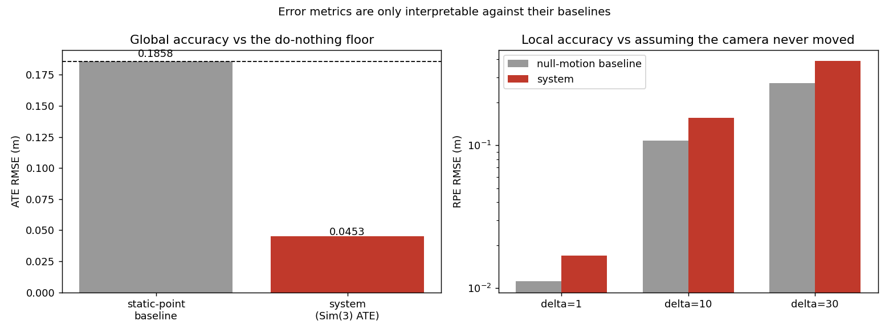

# vision_system — Visual Odometry & Loop Closure

An RGB-D visual SLAM pipeline consolidated from four earlier prototypes, then
benchmarked against real ground truth on **TUM RGB-D `freiburg1_xyz`** — and
then benchmarked against the *trivial estimators* the metrics have to beat,
which is what turned the original results over.

## Headline results

Benchmarked on **TUM RGB-D `freiburg1_xyz`** against real ground truth — and,
crucially, against the trivial estimators the metrics have to beat.

| | Before | **After** | Baseline to beat |
|---|---|---|---|
| ATE RMSE, Sim(3) | 0.1814 m (0.98×) | **0.0453 m (0.24×)** | 0.1858 m |
| ATE RMSE, SE(3) | 2.6304 m (14.16×) | **0.0453 m (0.24×)** | 0.1858 m |
| Recovered scale | 0.0152 | **0.9975** | 1.0 = metric |
| Path length | 17.83 m | **8.147 m** | 8.011 m (GT) |
| Loop closure, ATE SE(3) | 0.6517 → 0.3029 m (artifact) | **0.0472 → 0.0237 m (−49.8%)** | 0.1857 m |
| RPE RMSE, delta=1 | 0.0260 m (2.33×) | 0.0169 m (**1.52×, still failing**) | 0.0112 m |

SE(3) ATE improved by a factor of **58**, and scale went from a 66× collapse to
essentially metric. The one metric still failing its baseline is RPE, and
[RESULTS.md §5](RESULTS.md) documents what was tried and why it is a noise-floor
problem rather than a tuning problem.



---

## What this project is

The four original repositories mixed working prototype code with untested,
AI-generated scaffolding. This repo consolidates them into one pipeline that
runs, and measures it. The measurement is the contribution — which means the
measurement itself has to be right, and the first version of it was not.

The failure analysis now has two layers:

**Bugs found by benchmarking against ground truth** — missing RANSAC in
`solvePnP`, pose composed without inverting, and unit-scale translation from
the essential-matrix fallback treated as metric. These were real and are fixed.

**Bugs found by benchmarking against baselines** — the layer the first pass
missed. With a static-point floor and a null-motion floor attached to every
metric, it became clear the tracker had not cleared either, which reframed the
"residual drift is architectural" conclusion as a live bug and led to the
distortion fault.

The general lesson is in `evaluation/metrics.py`: on a sequence with 8 m of
motion inside a 0.70 m volume, an error of 0.18 m in metres tells you nothing
until you know that doing nothing scores 0.19 m.

---

## Quick start

```bash
git clone https://github.com/itsayushnst13/vision_system.git
cd vision_system

python -m venv venv && source venv/bin/activate
pip install -r requirements.txt
```

Some results need no dataset at all — the synthetic distortion test and the
recomputed baselines both run immediately:

```bash
python run_all.py --no-dataset
```

For the full benchmark, download the TUM RGB-D `freiburg1_xyz` sequence from
[vision.in.tum.de](https://vision.in.tum.de/data/datasets/rgbd-dataset/download)
and extract it so this path exists:

```
data/rgbd_dataset_freiburg1_xyz/
├── rgb/            rgb.txt
├── depth/          depth.txt
└── groundtruth.txt
```

The dataset is ~460 MB and is deliberately **not** committed.

```bash
python run_all.py              # everything (~10 min)
python run_all.py --skip-train # reuse existing classifier artifacts
```

Individual stages:

```bash
python tests/test_distortion_bug.py                   # synthetic, no dataset
python evaluation/recompute_from_committed.py         # baselines, no dataset
python evaluation/evaluate_tum.py                     # VO benchmark
python evaluation/retrain_loop_closure_real_labels.py # classifier training
python evaluation/evaluate_tum_with_loop_closure.py   # loop closure ON vs OFF
python evaluation/make_figures.py                     # figures only
```

---

## The findings

### 1. Metrics without baselines hid a non-functional tracker

`freiburg1_xyz` covers 8.01 m of path inside a volume 0.70 m across. A fixed
point scores ATE 0.1858 m; reporting zero motion scores RPE(1) 0.0112 m. The
system scored 0.1814 m and 0.0260 m — at and above those floors. Every metric
now reports its baseline and the ratio to it.

The alignment was also wrong: `align()` used the RMS-ratio scale rather than
the least-squares-optimal Umeyama scale, reporting ATE 0.2324 m where the
minimiser gives 0.1814 m.

And the drift model was wrong. Linear RPE growth was read as unbiased
accumulation, but unbiased accumulation grows as √delta. The measured constant
bias (0.004 m/step) is too small to explain linear growth either — the errors
are temporally *correlated*, which is a bug signature.

### 2. Lens distortion was applied on one side of the geometry only

`_compute_3d_points` back-projected **raw distorted** pixels with the pinhole
model, while `solvePnPRansac` was passed `dist_coeffs` and applied the
distortion model to the same points. fr1's distortion is large (k1=0.26,
k2=-0.95, k3=1.16), and the error varies with image radius, so it never
averages out. The same bug existed a second time in `_create_keyframe`.

Isolated on a synthetic scene with the real intrinsics, known correspondences
and a fixed seed — so only distortion handling differs:

| Metric | Mishandled | Fixed |
|---|---|---|
| ATE Sim(3) | 0.1980 m | **0.0038 m** |
| RPE delta=1 | 0.0651 m | **0.0008 m** |
| Recovered scale | 0.0127 | **0.9973** |
| Path length (GT 3.388 m) | 26.042 m | **3.393 m** |

The mishandled run reproduces the real sequence's signature — scale collapse,
ATE pinned to the baseline, linear RPE growth, inflated path length. This test
was written before the dataset was available; fixing the bug on real data then
moved scale 0.0152 → 0.9975 and SE(3) ATE 2.6304 → 0.0453 m, as predicted.

### 3. The loop-closure gain was compaction, not correction

The residual `w * (p[j] - p[i])` forces two keyframes to occupy the *same
position* at 15× the odometry weight. A loop closure means two frames see the
same place, not that the camera is in the same spot. The result improved ATE
while making RPE 3× worse, doubling path length, and producing a 1.77 m jump on
a 0.70 m trajectory.

Loop edges now carry a measured relative translation from geometric
verification, weight is 3× not 15×, and unmeasurable edges are dropped. On
fr1/xyz this gives a genuine **−49.8%** ATE reduction with RPE flat (+1.9%) and
path length moving toward ground truth (7.729 → 7.984 m, GT 7.897 m), from 11
closures each verified with 81–584 PnP inliers.

Also fixed: three other tracking defects (a ratio test that wasn't one,
single-pixel depth sampling, unenforced depth limits, and PnP refinement that
was commented but never performed) — see RESULTS.md §3.

---

## Repository layout

```
vision_system/
├── run_all.py                    # reproduce everything (--no-dataset works)
├── requirements.txt
├── RESULTS.md                    # full metrics, all measured on real data
├── src/
│   ├── system.py                 # tracking + keyframes + verified loop closure
│   ├── tracking.py               # feature tracking & pose estimation
│   ├── live_loop_closure.py      # classifier + geometric verification
│   ├── pose_graph_optimizer.py   # pose-graph relaxation with measured edges
│   ├── run_slam.py               # interactive runner (webcam / video / images)
│   ├── main.py                   # RGB-D dataset runner with 3D visualisation
│   ├── mapping.py                # STUB — not wired into the pipeline
│   ├── cnn_loop_closure.py       # LEGACY, non-functional — see note in file
│   └── random_forest_loop_closure.py  # LEGACY, non-functional
├── evaluation/
│   ├── metrics.py                # ATE, RPE, Umeyama, BASELINES, drift model
│   ├── evaluate_tum.py           # VO benchmark
│   ├── recompute_from_committed.py  # re-derive published numbers, no dataset
│   ├── retrain_loop_closure_real_labels.py
│   ├── evaluate_tum_with_loop_closure.py
│   └── make_figures.py
├── tests/
│   └── test_distortion_bug.py    # controlled distortion experiment, no dataset
├── config/camera_config.yaml     # every key here is actually read
├── results/                      # metrics (.npz), models (.joblib), figures/
└── data/                         # dataset, not committed — see Quick start
```

---

## Known limitations

- **RPE still fails its baseline** at every frame gap (1.43–1.52×). Depth patch
  size, RANSAC thresholds and reference-frame tracking were all tested and none
  move it; the limit is single-frame-depth PnP noise against ~1 cm of per-frame
  motion. Needs local bundle adjustment. See RESULTS.md §5.
- **RPE still grows linearly rather than as √delta**, so correlated error
  remains — rotation is the prime suspect, and the pose graph corrects
  translation only.
- **One sequence**, and one with unusually small motion, which makes the
  baselines unusually hard to beat and RPE unusually uninformative.
- **No CNN similarity feature** — PyTorch unavailable; both compared classifiers
  use the same 8 SIFT features, so the comparison stays like-for-like.
- **`src/mapping.py` is a stub** (`_triangulate_new_points` and
  `_local_bundle_adjustment` are `pass`) and nothing instantiates it.
- **Two legacy modules are non-functional** — `cnn_loop_closure.py` and
  `random_forest_loop_closure.py` inherit from a base class that lived in the
  original standalone repo and was never merged. Kept as reference
  implementations of the synthetic-label classifier.

## Next steps

1. Add local bundle adjustment over multi-frame point estimates — the one
   change that should move RPE below its baseline.
2. Extend the pose graph to correct rotation, and check whether the residual
   correlated error is rotational.
3. Validate on fr1/desk and fr2/xyz. Larger motion makes the baselines easier
   to clear and RPE genuinely informative; a result on one small-motion
   sequence is not evidence of generality.
4. Require N-consecutive-frame consistency before accepting a closure, on top
   of geometric verification.
5. Restore the CNN similarity feature once PyTorch is available.
6. Implement or remove `src/mapping.py`.

## Data & attribution

Evaluated on the TUM RGB-D benchmark (Sturm et al., *A Benchmark for the
Evaluation of RGB-D SLAM Systems*, IROS 2012), available from the
[Computer Vision Group, TU Munich](https://vision.in.tum.de/data/datasets/rgbd-dataset).
The dataset is not redistributed here.
