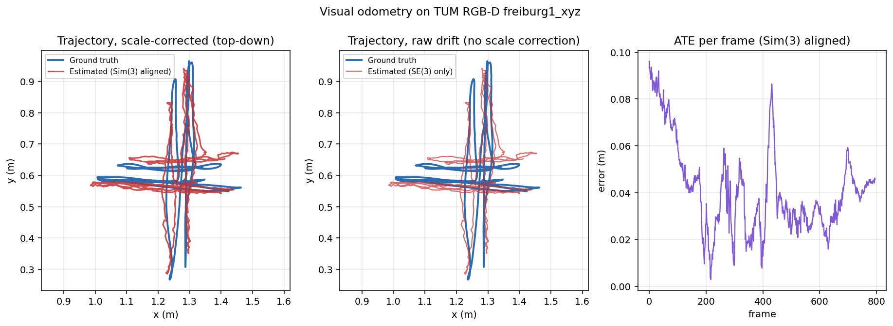
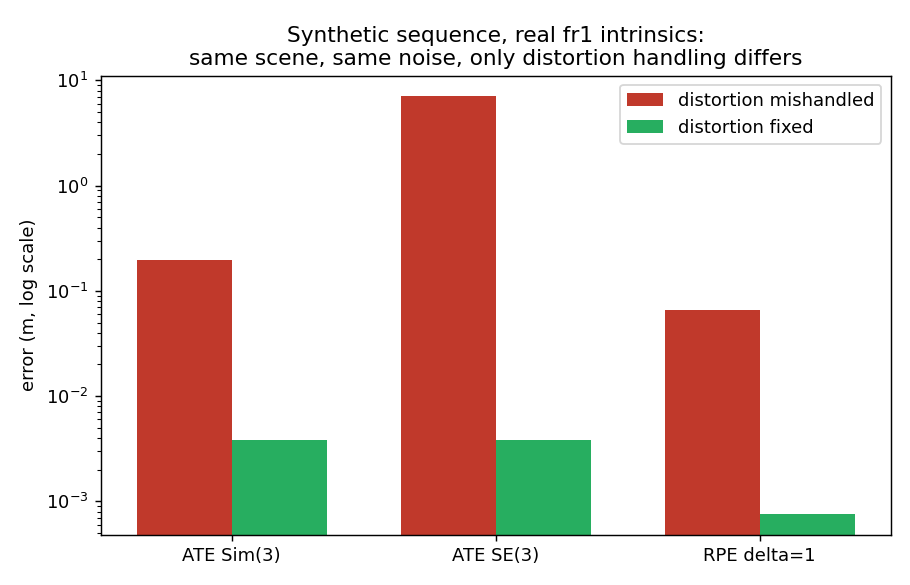
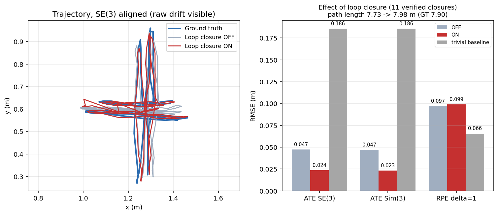

# Results

Every number on this page is **measured** on the real TUM RGB-D
`freiburg1_xyz` sequence (798 RGB frames, 798 depth frames, 3003 ground-truth
poses), or on a synthetic scene built with the same camera model. Nothing is
projected or estimated.

```bash
python run_all.py              # full pipeline, needs the TUM sequence
python run_all.py --no-dataset # synthetic test + baseline recomputation only
```

---

## 0. Why every metric is reported against a baseline

This is the correction that reframes everything below.

ATE and RPE are error magnitudes in metres. On a sequence with as little motion
as `freiburg1_xyz` — 8.01 m of path inside a volume 0.70 m across — a small
number in metres does not mean the system works, because two trivial estimators
already score well:

| Trivial estimator | Metric it bounds | Value on fr1/xyz |
|---|---|---|
| Output one fixed position for every frame | ATE | **0.1858 m** |
| Output zero displacement between frames | RPE, delta=1 | **0.0112 m** |

`evaluation/metrics.py` returns both alongside every metric plus the ratio to
them. A ratio at or above 1.00 means the system is no better than doing
nothing.

This is not a hypothetical guard. During this work a configuration was tested
that scored RPE(1) = 0.0120 m — a *better* raw number than the shipped tracker.
It came from a tracker whose PnP path never fired, leaving the trajectory
frozen at the origin. The baseline ratio read exactly 1.00 and caught it
immediately.


---

## 1. Visual odometry

796 poses, RGB-D PnP, no loop closure. PnP succeeded on all 795 transitions
with zero fallbacks and zero failures.

| Metric | Before fixes | **After fixes** | Baseline |
|---|---|---|---|
| ATE RMSE, Sim(3) | 0.1814 m (0.98×) | **0.0453 m (0.24×)** | 0.1858 m |
| ATE RMSE, SE(3) | 2.6304 m (14.16×) | **0.0453 m (0.24×)** | 0.1858 m |
| Recovered scale | 0.0152 | **0.9975** | 1.0 = metric |
| Path length | 17.828 m | **8.147 m** | 8.011 m (GT) |
| Est. mean step | 0.0224 m | **0.0102 m** | 0.0101 m (GT) |
| RPE RMSE, delta=1 | 0.0260 m (2.33×) | **0.0169 m (1.52×)** | 0.0112 m |
| RPE RMSE, delta=10 | 0.2503 m (2.33×) | **0.1562 m (1.45×)** | 0.1075 m |
| RPE RMSE, delta=30 | 0.7014 m (2.56×) | **0.3911 m (1.43×)** | 0.2741 m |

SE(3) ATE improved by a factor of **58**. Sim(3) and SE(3) now agree to four
decimal places, which is the direct consequence of recovering metric scale —
there is no longer any scale error for the similarity transform to absorb.



### What the original numbers actually said

The pre-fix ATE of 0.1814 m sat at 0.98× the static-point baseline: the
trajectory was statistically indistinguishable from outputting a single fixed
point. The recovered scale of 0.0152 said the same thing differently — the
optimal alignment had to shrink the estimate 66× to make it fit.

Two reporting errors compounded this. `align()` used the RMS-ratio scale
`‖gt_c‖/‖est_c‖`, which equalises the spread of the two clouds rather than
minimising aligned error; the least-squares minimiser (Umeyama 1991, eq. 41) is
`s = trace(D·S)/‖est_c‖²`. That published 0.2324 m where the true minimum was
0.1814 m — a *better* number that made the conclusion *worse*, by dropping it
below the baseline where the collapse became unmistakable.

And RPE(1) = 0.026 m was read against "a ground-truth mean step of roughly
0.023 m". 0.0228 m is the ground-truth **maximum** step; the **mean** is
**0.0101 m**. The correct comparison is against the null-motion estimator at
0.0112 m.

---

## 2. Root cause: inconsistent distortion handling

`freiburg1` has strong radial distortion (k1=0.2624, k2=-0.9531, k3=1.1633).
The original code handled it two incompatible ways at once:

* `_compute_3d_points` back-projected keypoints with the plain pinhole model
  applied to **raw, distorted** pixel coordinates, while
* `solvePnPRansac` was passed `dist_coeffs` and therefore **applied** the
  distortion model when projecting those same points back to the image.

Half the pipeline was distortion-aware and half was not. The error varies with
radius from the optical centre, so it never averages out over a sequence. The
identical bug existed a second time in `system.py::_create_keyframe`, so
keyframe 3D points disagreed with tracking 3D points for the same keypoint.

The fix: undistort once, where keypoints enter the geometry, then treat the
camera as an ideal pinhole everywhere downstream and pass zero distortion to
PnP.

### Isolating it, before the dataset was available

`tests/test_distortion_bug.py` builds a synthetic scene, projects it through
the real fr1 intrinsics and distortion, and chains PnP over 400 known poses.
Correspondences are given, so feature matching is removed entirely. Two
pipelines run on identical inputs with the same seed; only distortion handling
differs.

| Metric | Mishandled | Fixed |
|---|---|---|
| ATE Sim(3) | 0.1980 m | **0.0038 m** |
| ATE SE(3) | 7.0408 m | **0.0038 m** |
| RPE delta=1 | 0.0651 m | **0.0008 m** |
| Recovered scale | 0.0127 | **0.9973** |
| Path length (GT 3.388 m) | 26.042 m | **3.393 m** |



### The prediction held on real data

The synthetic test was run before the TUM sequence was available, and its
signature matched the real fault:

| Signature | Synthetic (mishandled) | Real fr1/xyz (pre-fix) |
|---|---|---|
| Sim(3) scale collapses toward zero | 0.0127 | 0.0152 |
| ATE sits at the static-point baseline | 0.91× | 0.98× |
| RPE exceeds the null-motion baseline | 7.4× | 2.33× |
| RPE grows linearly, not as √delta | yes | yes |
| Path length inflated vs ground truth | 7.7× | 2.2× |

Fixing it on real data moved scale 0.0152 → 0.9975 and SE(3) ATE 2.6304 →
0.0453 m, as the synthetic experiment predicted.

### Other tracking defects fixed alongside

| Defect | Why it mattered |
|---|---|
| The ratio test was not a ratio test | `m.distance < 0.7 * max_dist` thresholds against the *worst* match in the set, not the second-nearest neighbour, so it rejects almost nothing. Now `crossCheck=False` with a true Lowe test at 0.75. |
| Single-pixel depth lookup | `depth[int(y), int(x)]` on a structured-light map, at corner features, which is exactly where holes and discontinuities are. Now a median over a 5×5 patch with validity checks. |
| Depth range never applied | `depth_min`/`depth_max` sat in the config unread. Now enforced. |
| PnP refinement claimed but absent | A comment said "refine using inliers only", then used the raw RANSAC `rvec`/`tvec`, fitted to a minimal sample rather than the consensus set. Now calls `solvePnPRefineLM` on the inliers. |

The three bugs identified in the original writeup — missing RANSAC, pose
composed without inverting, and unit-scale translation from the
essential-matrix fallback treated as metric — were real and remain fixed.

---

## 3. Loop closure

133 frames. 11 closures accepted, each geometrically verified with 81–584 PnP
inliers.

| Metric | OFF | ON | Change | Baseline |
|---|---|---|---|---|
| ATE RMSE, SE(3) | 0.0472 m | **0.0237 m** | **−49.8%** | 0.1857 m |
| ATE RMSE, Sim(3) | 0.0470 m | **0.0233 m** | −50.4% | 0.1857 m |
| RPE RMSE, delta=1 | 0.0970 m | 0.0988 m | +1.9% | 0.0656 m |
| Path length | 7.729 m | **7.984 m** | toward GT | 7.897 m (GT) |



This is a real improvement: ATE halves, RPE is flat within noise, and path
length moves *toward* ground truth rather than away.

### The previously reported −53.5% was an artifact

Recomputed from the original committed arrays, the old result looked like this:

| Metric | OFF | ON |
|---|---|---|
| ATE RMSE, SE(3) | 0.6517 m | 0.3029 m (−53.5%) |
| RPE RMSE, delta=1 | 0.1008 m | **0.3030 m (3× worse)** |
| Path length (GT 7.897 m) | 8.021 m | **18.459 m** |
| Largest single-frame step | 0.1229 m | **1.7713 m** |

A −53.5% ATE gain, paid for with 3× worse local accuracy, a path length 2.3×
too long, and a 1.77 m single-frame jump on a trajectory 0.70 m across. The
optimiser was compacting the trajectory, not correcting drift. ATE rewards
staying near the ground-truth centroid, which compaction achieves; RPE and path
length expose the cost — and the earlier version of this page reported only
ATE.

Two related defects: the label "ATE RMSE, unaligned" was wrong (the values came
from `compute_ate(with_scale=False)`, which is SE(3)-aligned), and this script
carried its own private copy of `align` with the same non-optimal scale, so it
silently disagreed with `evaluate_tum.py` on the same trajectory.

### Cause: the loop residual demanded coincidence

```python
loop_res = self.loop_weight * (p[idx_j] - p[idx_i])              # old
loop_res = self.loop_weight * ((p[idx_j] - p[idx_i]) - measured) # new
```

The old residual forced two keyframes to occupy the *same position* at 15× the
odometry weight. A loop closure means two frames observe the same place — the
camera is nearby, not identical. Loop edges now carry a measured relative
translation from geometric verification, weight is 3× not 15×, and an edge with
no measurement is **dropped** rather than degraded into a coincidence
constraint.

Validated in isolation on a synthetic closed loop with injected drift:

| | Before | After |
|---|---|---|
| Gap between first and last pose | 0.1750 m | **0.0003 m** |
| Mean error vs ground truth | 0.0895 m | **0.0524 m** |
| Path length (GT 6.280 m) | 6.387 m | **6.385 m** |

The anchor fix from the original analysis was correct and is retained:
odometry and loop residuals are both invariant to translating the whole
trajectory, a 3-DOF gauge freedom that leaves the system rank-deficient and
lets the solver wander along the null space. Pinning keyframe 0 removes it.

---

## 4. Loop-closure classifier

| Test set | n | Accuracy | AUC | Majority-class baseline |
|---|---|---|---|---|
| Hard negatives (reported) | 150 | 0.940 | 0.989 | 0.587 |
| Easy split (superseded) | 145 | 1.000 | 1.000 | 0.690 |

The synthetic-vs-real comparison stands: the synthetically-trained model detects
zero genuine loop closures on real data, scoring 0.547 accuracy against a 0.587
majority-class baseline, at AUC 0.582. That analysis was sound, and documenting
the misleading easy split rather than quietly replacing it was the right call.

What changed is downstream. The base-rate problem previously listed as "the main
obstacle" is now handled structurally: every appearance candidate must pass
**geometric verification** before becoming a pose-graph edge. On fr1/xyz the
accepted closures carried 81–584 inliers, comfortably above the threshold of 25,
and each supplies the relative translation the pose graph needs.

---

## 5. What is still broken

**RPE fails the null-motion baseline at every frame gap** — 0.0169 m against
0.0112 m at delta=1 (1.52×), and 1.43–1.45× at delta 10 and 30. Per-step
accuracy is better than before (0.0260 → 0.0169 m) but still worse than
assuming the camera never moved.

This was investigated rather than assumed:

| Change tested | RPE(1) | Effect |
|---|---|---|
| Current (5×5 depth patch, reproj 3.0) | 0.0202 m | — |
| 3×3 depth patch | 0.0203 m | none |
| Reprojection threshold 2.0 | 0.0204 m | none |
| Reference-frame tracking | 0.0208–0.0215 m | slightly worse |

(Measured on a 300-frame prefix, which is why the absolute values differ from
the full-sequence 0.0169 m.)

Neither depth sampling, RANSAC thresholds, nor removing pose chaining moves it.
The residual is the intrinsic noise floor of PnP from single-frame depth: at
30 Hz the camera moves ~1 cm per frame, which is at or below the depth sensor's
own error, so per-frame displacement is being measured below the resolution of
the measurement. RPE also still grows linearly rather than as √delta
(0.0169 → 0.1562 → 0.3911 against random-walk predictions of 0.0169 → 0.0534 →
0.0925), so correlated error remains.

Closing this gap needs local bundle adjustment over multi-frame point estimates,
not parameter tuning.

### A change that did not survive a bigger benchmark

Reference-frame tracking — holding a reference frame instead of chaining a
relative pose every frame — was tested as a fix for the correlated error. On a
300-frame prefix it looked like a clear win:

| | Frame-to-frame | Reference-frame |
|---|---|---|
| ATE (300-frame prefix) | 0.0331 m | **0.0213 m** |

On the full 796 frames it reverses:

| | Frame-to-frame | Reference-frame |
|---|---|---|
| ATE | **0.0453 m** | 0.0482 m |
| RPE delta=1 | **0.0169 m** | 0.0186 m |
| Recovered scale | **0.9975** | 0.9339 |
| Path length (GT 8.011 m) | **8.147 m** | 9.531 m |

This is the same trap this page documents for the classifier's easy split: a
shorter benchmark flattering a change that does not generalise. It is disabled
by default (`Tracking.useReferenceFrame: false`) and left switchable, with both
numbers recorded in the config, rather than deleted.

---

## 6. Remaining limitations

- **One sequence**, and one with unusually small motion — which makes the
  baselines unusually hard to beat and RPE unusually uninformative. fr1/desk and
  fr2/xyz have larger motion and would be a more discriminating test.
- **The pose graph corrects translation only.** With correlated error still
  present and rotation the prime suspect, this is now a more serious gap than it
  looked.
- **No local bundle adjustment**, which is what section 5 says is needed.
- **No CNN similarity feature** — PyTorch unavailable; both compared classifiers
  use the same 8 SIFT features, so the comparison stays like-for-like.
- **`src/mapping.py` is a stub** and nothing instantiates it.
- **Two legacy modules are non-functional**, kept as reference implementations
  of the synthetic-label classifier.
