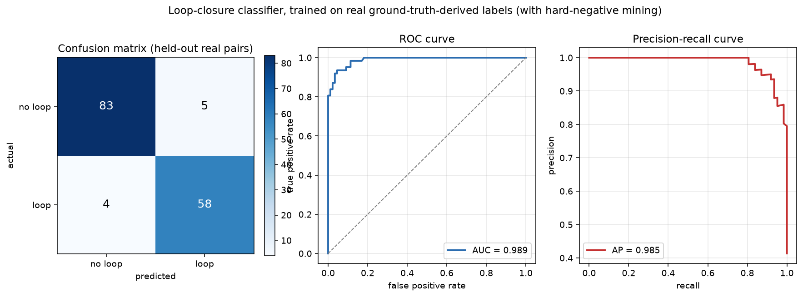
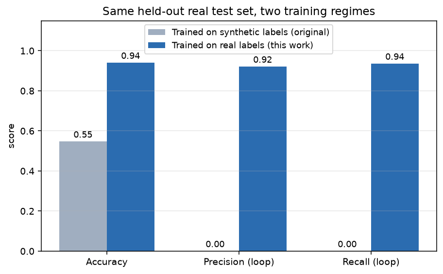

# Results

Every number on this page was produced by the scripts in `evaluation/` on
the **TUM RGB-D `freiburg1_xyz`** sequence (real recorded data, real
motion-capture ground truth). Nothing here is estimated, projected, or
carried over from the original prototypes. To regenerate all of it:

```bash
python run_all.py
```

Artifacts land in `results/*.npz`; figures in `results/figures/`.

---

## 1. Visual odometry

796 frames, RGB-D (depth-aided PnP) tracking, no loop closure.

### Absolute Trajectory Error

| Alignment | RMSE | Mean | Median | Std | Max |
|---|---|---|---|---|---|
| Sim(3) — scale corrected | **0.2324 m** | 0.2145 | 0.2165 | 0.0895 | 0.4435 |
| SE(3) — raw accumulated drift | **2.6304 m** | 2.5695 | 2.4993 | 0.5624 | 4.1206 |

### Relative Pose Error (translation)

RPE measures *local* accuracy over a fixed frame gap, so unlike ATE it is
not swamped by accumulated drift.

| Frame delta | RMSE | Mean | Median |
|---|---|---|---|
| 1 | **0.0260 m** | 0.0247 | 0.0238 |
| 10 | 0.2503 m | 0.2387 | 0.2281 |
| 30 | 0.7014 m | 0.6743 | 0.6257 |

### Reading these two together

This is the central diagnostic of the VO work. **Per-step tracking is
sound**: RPE at delta=1 is 0.026 m against a ground-truth mean step of
roughly 0.023 m, so each individual frame-to-frame estimate is close to
correct. But RPE grows roughly linearly with the frame gap (0.026 → 0.250 →
0.701 for delta 1 → 10 → 30), which is the signature of *unbiased errors
accumulating* rather than a systematically broken estimator.

The consequence shows up in the trajectory statistics:

| | Estimated | Ground truth |
|---|---|---|
| Path length | 17.83 m | 8.01 m |
| Largest single-frame step | 0.0431 m | 0.0228 m |
| Recovered scale factor | 0.0697 | 1.0 (ideal) |

No catastrophic pose jumps remain (max step 0.043 m is the same order as
real motion) — those were eliminated by the tracking fixes below. What
remains is **drift**, which frame-to-frame VO cannot fix on its own. That
is precisely what the loop-closure work in §3 addresses.


### Tracking bugs fixed to reach this baseline

Each was found by running against real ground truth, not by inspection:

| Bug | Effect before fix |
|---|---|
| `solvePnP` used with no outlier rejection | A single bad correspondence produced wild one-frame pose jumps that propagated through the chained trajectory; ATE exceeded 10⁶ m |
| Pose composed in the wrong direction | `solvePnP`/`recoverPose` return previous→current; the code composed `prev_pose @ transform` without inverting, corrupting every accumulated pose |
| Essential-matrix fallback used unit-scale translation | `cv2.recoverPose` returns a *direction* only (unit-normalised); using it raw injected ~1.0 m jumps into a trajectory whose real per-frame motion is ~0.02 m, destroying metric scale |

---

## 2. Loop-closure classifier

The original classifier was trained on synthetic Gaussian feature vectors
with heuristic labels — it had never seen a real loop closure. It was
retrained on labels derived from ground truth: a pair is **positive** when
the camera positions are within 0.08 m *and* separated by more than 5 s (a
genuine revisit), and **negative** otherwise, with hard negatives drawn
from the ambiguous 0.12–0.35 m band.

### Current model (real labels + hard-negative mining), held-out test

150 pairs, never seen during training.

| Class | Precision | Recall | F1 | Support |
|---|---|---|---|---|
| no loop | 0.954 | 0.943 | 0.949 | 88 |
| **loop** | **0.921** | **0.935** | **0.928** | 62 |

**Accuracy 0.940 · ROC-AUC 0.989**

Confusion matrix:

| | predicted: no loop | predicted: loop |
|---|---|---|
| **actual: no loop** | 83 | 5 |
| **actual: loop** | 4 | 58 |



### Synthetic vs real training, same held-out test set

| Model | Accuracy | ROC-AUC | Precision (loop) | Recall (loop) |
|---|---|---|---|---|
| Original, synthetic labels | 0.547 | 0.582 | 0.000 | **0.000** |
| Retrained, real labels | **0.940** | **0.989** | 0.921 | 0.935 |

The synthetic-trained model detects **zero** genuine loop closures on real
data, and its accuracy (0.547) is *below* the majority-class baseline
(88/150 = 0.587). Its ROC-AUC of 0.582 is near chance.



### An important caveat about an earlier version of this table

An earlier iteration of this evaluation used a wide margin between positive
(<0.08 m) and negative (>0.5 m) pairs, with no hard negatives. On *that*
test set the retrained model scored a perfect 1.000 accuracy and the
synthetic model scored 0.324 accuracy at 0.977 AUC.

Both of those numbers were misleading, in opposite directions:

- The retrained model's **1.000 was an artifact of a trivially separable
  test set**, and it did not survive contact with the live pipeline (see
  §3) — it over-triggered badly on the ambiguous middle ground the easy
  split never sampled.
- The synthetic model's **0.977 AUC was also an artifact of that same easy
  split**. On the realistic hard-negative test set its AUC collapses to
  0.582. The original model was substantially worse than the first
  evaluation suggested.

The harder benchmark is the honest one, and it is what §2 reports.

---

## 3. Loop closure in the live SLAM pipeline

The retrained classifier is wired into `src/system.py`: each new keyframe is
compared against older keyframes, and accepted loop closures feed a
pose-graph relaxation (`src/pose_graph_optimizer.py`) that corrects the
trajectory.

133 frames, 16 loop closures flagged.

| Metric | Loop closure OFF | Loop closure ON | Change |
|---|---|---|---|
| ATE RMSE, unaligned | 0.6517 m | **0.3029 m** | **−53.5%** |
| ATE RMSE, Sim(3)-aligned | 0.2212 m | **0.2032 m** | −8.1% |
| Corrections rejected by safety guard | — | 0 | — |


The unaligned improvement is much larger than the aligned one, and that is
expected rather than suspicious: loop closure removes accumulated drift,
and a post-hoc Sim(3) alignment already absorbs a good part of that same
drift before the aligned number is computed.

### The bug that made this result possible

The first integration attempt produced corrections proposing to move
keyframes by *hundreds of metres* on a ~2 m trajectory, and was initially
attributed to classifier false positives. That was only half the cause.

The pose-graph objective contained only odometry residuals (which constrain
*relative* positions) and loop-closure residuals (which constrain
*differences* between positions). Both are invariant to translating the
entire trajectory by a constant vector — a 3-DOF **gauge freedom** leaving
the problem rank-deficient, so the solver could drift arbitrarily far along
the null space at almost no cost. Adding an **anchor residual** pinning the
first keyframe to its original position removes the null space.

Validated in isolation on a synthetic loop with injected drift:

| | Before optimisation | After |
|---|---|---|
| Gap between first and last pose | 0.4549 m | **0.0001 m** |
| Mean error vs ground truth | 0.2795 m | **0.1564 m** |
| Largest correction applied | — | 0.4548 m (vs ~500 m pre-fix) |

### Honest limitations of the §3 result

- **False positives are being tolerated, not avoided.** 16 closures were
  flagged over 133 frames; the base-rate analysis says most are probably
  wrong. The trajectory still improves because the relaxation is dominated
  by odometry residuals, so an incorrect "these two nearby keyframes
  coincide" constraint is a mild error rather than a catastrophic one. The
  visible straight-line segments in the ON trajectory are these false
  positives.
- **The pose graph corrects translation only.** Rotation is left as the
  tracker estimated it.
- **One sequence.** This is a real measurement, not a projection, but it is
  not evidence of generality.
- **The classifier omits the CNN feature.** PyTorch was unavailable in the
  evaluation environment, so the retrained model uses the 8 classical
  SIFT-based features. Documented rather than silently dropped; both the
  synthetic and real models in §2 use the same feature set, so the
  comparison remains like-for-like.

---

## 4. Why the base rate matters

The v2b classifier scores 0.921 precision on a roughly balanced test set
(62 positive / 88 negative). Live, the picture is different: every new
keyframe is queried against several older candidates, nearly all of which
are true negatives. Good *balanced* precision therefore still yields many
more false positives than true positives in absolute terms.

This is a class-imbalance problem, not a calibration bug, and it is the
main obstacle to trusting loop closures without a safety net. The two
standard remedies — thresholding for the deployment base rate rather than
the training balance, and requiring N-consecutive-frame consistency before
accepting a closure — are listed as next steps in the README and are not
yet implemented.
